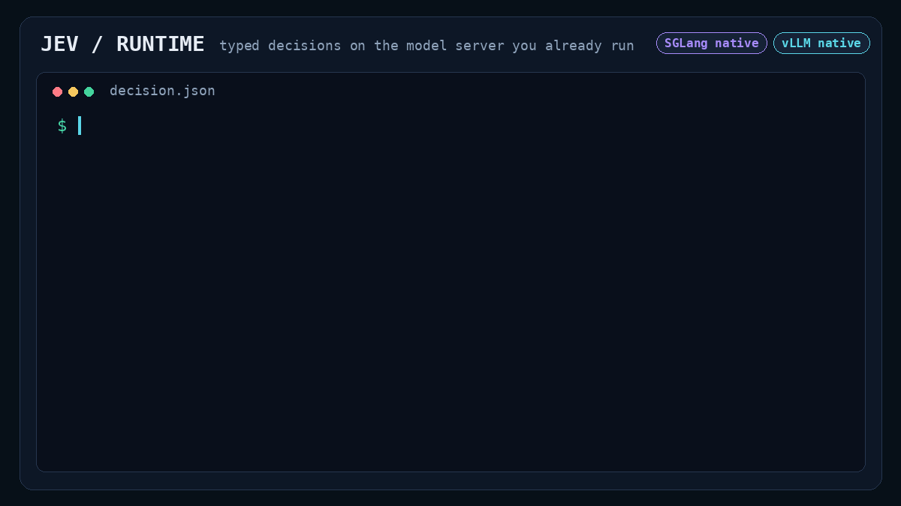

# Jev Runtime

**Turn the models you already serve into typed decision APIs.**

Route a support ticket. Choose the next agent action. Score an item. Rank candidates.
Jev Runtime reads candidate scores from **vLLM, SGLang, or experimental TokenSpeed**,
returns typed answers and probabilities, and lets you update versioned decision
bundles while requests are running. The model stays in its inference engine.

[Quick start](#quick-start) · [TokenSpeed](#tokenspeed-quick-start-experimental) ·
[Project comparison](#how-it-compares) ·
[Measured results](#measured-results) · [Documentation](#documentation)



```text
Your text + typed questions
          │
          ▼
  Jev Runtime plugin ── pinned bundle: model + tokenizer + template + policy
          │
          ▼
  vLLM / SGLang / TokenSpeed* ── candidate scores
          │
          ▼
  choice · boolean · score · rank + probabilities + version metadata
```

**Current release: `0.1.0a1`, development preview.** vLLM and SGLang have real GPU
evidence, including **10,004 and 10,006 strictly validated requests during live
bundle switching**. *TokenSpeed has a pinned launcher, preflight, async dispatch
and durable completion receipts; its GPU validation is still pending.* Production
certification and performance targets remain open. See [the evidence below](#measured-results).

Jev Runtime is independent of TypeSafe/Jev. It adds Jev-style decision serving to
existing models; it does not convert their weights into the proprietary Jev
architecture or reproduce its training.

## Why use it?

- **A decision interface your application can consume.** Choose from stable IDs,
  get a Boolean, compute an expected score over numeric levels, or rank all options.
  Outputs include probabilities and explicit answered/abstained/failed states.
- **Choose your serving engine.** vLLM and SGLang plugins add typed decisions
  alongside their ordinary serving endpoints. The experimental TokenSpeed launcher
  owns a native Engine and exposes the same typed/bundle APIs. All three offer a
  gateway path; each engine keeps its own environment.
- **Update decisions under traffic.** Upload, prepare, activate and roll back an
  immutable bundle. Each request keeps its original version through completion;
  generation checks prevent stale administrative updates.
- **Inspect what produced an answer.** Responses identify the engine, bundle,
  digest and generation. Preparation checks identity and runs a scoring canary.
  Admission limits, cancellation, health checks and Prometheus metrics are included.

No fine-tuning is required to try the API. Default probabilities are **uncalibrated**:
a valid distribution is not evidence that a business decision is correct. Use
[task evaluation](docs/public-quality.md) and [calibration](docs/calibration.md)
before choosing application thresholds.

## Quick start

Choose an engine first; the request and bundle commands are shared:

| Engine | Start here | Setup and evidence |
|---|---|---|
| vLLM | [Steps below](#1-install-the-engine-and-plugin) | SmolLM2 demo; 0.30.0+cu129; checkpoint-specific GPU evidence |
| SGLang | [SGLang quick start](docs/quickstart-sglang.md) | SmolLM2 demo; 0.5.19 CUDA 12.9 lane; checkpoint-specific GPU evidence |
| TokenSpeed | [TokenSpeed quick start](docs/quickstart-tokenspeed.md) | Pinned Qwen3-0.6B setup; compatible NVIDIA GPU required; experimental, GPU serving not yet validated |

This path runs pinned **SmolLM2-1.7B-Instruct** with the native vLLM plugin. It
requires Linux x86_64, Python 3.12, an NVIDIA GPU supporting BF16, a compatible
driver, and space for the model and GPU dependencies. Use a dedicated GPU for the
example memory settings. Initial downloads and startup can take several minutes.

Keep the engine environments separate. The vLLM installation commands below are
specific to that engine; TokenSpeed uses its own pinned source and native dependencies.

### 1. Install the engine and plugin

The repository is currently private; cloning requires access. Install from source;
these instructions do not assume a published PyPI release or container image.

```bash
git clone https://github.com/LLM-Perf/jev-runtime.git
cd jev-runtime
python3.12 -m venv .venv-vllm
source .venv-vllm/bin/activate
python -m pip install --upgrade pip
python -m pip install \
  'https://github.com/vllm-project/vllm/releases/download/v0.30.0/vllm-0.30.0%2Bcu129-cp38-abi3-manylinux_2_28_x86_64.whl' \
  --extra-index-url https://download.pytorch.org/whl/cu129
python -m pip install 'transformers==5.17.0' -e '.[tokenizers]' -e packages/vllm
python -m pip check
```

This selects the **0.30.0 CUDA 12.9 wheel used in our tests**. Other variants and
engine versions need separate validation; consult the
[upstream installation guide](https://docs.vllm.ai/en/v0.30.0/getting_started/installation/gpu/)
when matching the engine to your machine. An existing compatible vLLM environment
can skip engine installation and install just the core and plugin.

### 2. Prepare a reproducible configuration

```bash
python examples/prepare_quickstart.py --engine vllm
source .jev/quickstart-vllm/env.sh
```

The helper downloads revision `31b70e2e869a7173562077fd711b654946d38674`,
preserves its serialized tokenizer in a verified profile, and creates a config,
fresh SQLite registry location and two distinct local API/admin keys. Bootstrap
binds the prepared bundle to **`decision-model`**. Generated files live under
Git-ignored `.jev/`; keep `env.sh` private.

For offline use, add `--model-path /absolute/path/to/SmolLM2-1.7B-Instruct` containing
that exact checkpoint. This override does not verify weights against the Hub.
The helper rejects existing output directories: reuse `env.sh` or choose a new
`--output`. Build tokenizer profiles in the environment that will serve them.

### 3. Start vLLM

Run in the same terminal and leave the server running:

```bash
vllm serve "$JEV_MODEL_PATH" \
  --served-model-name "$JEV_MODEL_ID" --tokenizer "$JEV_TOKENIZER_PATH" \
  --host 127.0.0.1 --port "$JEV_PORT" --dtype bfloat16 \
  --max-model-len 2048 --max-num-seqs 4 --max-num-batched-tokens 512 \
  --max-logprobs 128 --gpu-memory-utilization 0.8 \
  --enforce-eager --shutdown-timeout 30
```

The helper sets `VLLM_PLUGINS=jev_runtime_api` and `JEV_CONFIG`. vLLM's fraction
uses **total GPU memory**: reduce it for a shared device after checking available
memory. These are small-model startup settings, not a throughput-tuned profile.

### 4. Make your first decision

In a second terminal, from the repository root:

```bash
source .venv-vllm/bin/activate
source .jev/quickstart-vllm/env.sh
curl --fail-with-body "$JEV_URL/ready" \
  -H "Authorization: Bearer $JEV_API_KEY"
jevctl decide examples/request.json --url "$JEV_URL"
```

Wait for `/ready` to return `"ready": true`. The example asks for the intent of
“I was charged twice and would like a refund” and whether a refund was explicitly
requested. A completed response includes `answers.intent` and
`answers.refund_requested`, each with `status`, `value`, `probabilities` and
`probability_semantics`, plus `bundle`, `bundle_digest`, `generation`, `engine`
and usage. Values depend on the model; handle abstention explicitly.

Example excerpt from the [DSW quick-start check](docs/readme-validation.md)
(metadata omitted, probabilities rounded):

```json
{
  "bundle": "default@1",
  "generation": 1,
  "answers": {
    "intent": {
      "value": "billing",
      "probabilities": {"billing": 0.7159, "technical": 0.1597, "other": 0.1244}
    },
    "refund_requested": {
      "value": true,
      "probabilities": {"true": 0.7982, "false": 0.2018}
    }
  }
}
```

Any HTTP client can call the same endpoint:

```bash
curl --fail-with-body "$JEV_URL/v1/decisions" \
  -H "Authorization: Bearer $JEV_API_KEY" \
  -H 'Content-Type: application/json' \
  --data-binary @examples/request.json
```

Native plugins use **`/plugins/jev-runtime`**, already included in `JEV_URL`.
The standalone gateway has no such prefix. `/v1/decisions` is the primary API.
A limited `/v1/systemone` adapter also exists with the schema
`jev-runtime-systemone-v1`; full TypeSafe SDK compatibility is not claimed.
For example, Noul returns `p_true`, and Score uses `levels` with optional `values`.
See the [schema](src/jev_runtime/schema.py) and [adapter](src/jev_runtime/systemone.py).

### 5. Try a live bundle update

With the fresh quick-start registry, `default@1` is active at generation `1`:

```bash
jevctl bundle list --url "$JEV_URL"
jevctl bundle build-remote "$JEV_RUN/demo-v2.json" --url "$JEV_URL" --name demo --version 2
jevctl bundle upload "$JEV_RUN/demo-v2.json" --url "$JEV_URL"
jevctl bundle prepare demo@2 --url "$JEV_URL"
jevctl bundle activate demo@2 decision-model 1 --url "$JEV_URL"
jevctl decide examples/request.json --url "$JEV_URL"
```

The response should now identify `demo@2`, generation `2`. This publishes the same
default settings under a new version to demonstrate the lifecycle. For a real
update, edit the new bundle's template, policy or supported calibration before
upload. Existing ID/version pairs cannot be overwritten with different content.

Roll back without reloading weights:

```bash
jevctl bundle activate default@1 decision-model 2 --url "$JEV_URL"
```

Rollback advances the generation to `3`; it does not reset history. On repeat runs,
read `bundle list` and use the current generation instead of copying `1` or `2`.
Before stopping the server, follow [quiescence and ordered shutdown](docs/quiescence.md),
including its offline resume step when restarting the preserved registry.

These preparation, startup, request, activation and rollback steps passed on the
vLLM and SGLang DSW environments. The smoke reused installed dependencies and local weights;
it did not test a fresh network installation. [Exact scope and evidence](docs/readme-validation.md).

## TokenSpeed quick start (experimental)

Use the [complete installation guide](docs/quickstart-tokenspeed.md) to prepare
TokenSpeed at `f4ac1affe11ad404720bcd150970487f75fbf59a` in its own environment.
The launcher accepts NVIDIA `sm90`, `sm100`, `sm103` or `sm107`; the existing L20Z
DSW is outside this profile. The documented CUDA 12.9 recipe targets H100/H200
with Python 3.11. Other supported architectures need their matching upstream stack.

From the Jev repository root, **after activating that TokenSpeed environment**:

```bash
python -m pip install -e '.[tokenizers]' -e packages/tokenspeed
python examples/prepare_tokenspeed.py
source .jev/quickstart-tokenspeed/env.sh
export CUDA_VISIBLE_DEVICES=0
jev-tokenspeed --config "$JEV_CONFIG" --engine-config "$JEV_ENGINE_CONFIG" --check
jev-tokenspeed --config "$JEV_CONFIG" --engine-config "$JEV_ENGINE_CONFIG"
```

The helper pins Qwen3-0.6B, preserves its tokenizer and creates matching configs
plus separate API/admin keys. In a second terminal, activate the same environment,
source the same `env.sh`, then use [the request](#4-make-your-first-decision) and
[bundle update](#5-try-a-live-bundle-update) commands above. The endpoint prefix
is `/plugins/jev-runtime`, with default port `8796` and alias `decision-model`.

This path supports Choice, Boolean, Score, Rank and live bundle updates through
the shared API. It currently uses **one native request per label**; it does not
offer joint selected-ID gathering or a chat endpoint. Keep the registry and its
separate completion-receipt database together when operating the service.
[TokenSpeed limits and validation evidence](docs/tokenspeed-validation.md).

## What is supported today?

| Engine | Integration | GPU functional coverage | Current boundary |
|---|---|---:|---|
| vLLM 0.30.0+cu129 | Native endpoint plugin; gateway via plugin scoring | 12/20 model profiles | Other versions/topologies need validation; a plain OpenAI endpoint is insufficient for gateway scoring |
| SGLang 0.5.19 | Native plugin; HTTP gateway | 12/20 model profiles | CUDA 12.9 test lane; 0.5.20 not certified; 0.5.19 mixed traffic needs engine-side compatibility hooks |
| TokenSpeed `f4ac1affe11a` | Native Engine launcher, preflight, async dispatch, durable receipts and HTTP bridge | 0/20 model profiles | Experimental; eager TP/DP/PP=1; K labels need K native scoring calls; native GPU validation pending |
| Additional engines | `jev_runtime.backends` entry point | Not measured | Must implement and validate the complete scoring/lifecycle contract |

Coverage means checkpoint-specific functional evidence, **not** every model in an
engine's catalog, full numerical equivalence or release certification. See the
[model matrix](profiles/certification-matrix.json),
[framework status](profiles/framework-support.json) and [backend guide](docs/multi-engine.md).
Current decision input is text; multimodal serving is not implemented.

**Hot swap has a specific scope.** Bundle templates, policies and calibration can
change online with request pinning and drain. Plugin Python/CUDA upgrades and base
model replacement need a process rollout. Managed LoRA has separate
[lifecycle requirements](docs/adapters.md). Shared registry coordination is local
to one host; multi-node atomic publication and failover are not certified.

## How it compares

Other projects' primary documentation was checked **2026-09-30**; the Jev Runtime
row includes the **2026-10-09 TokenSpeed update**. This compares documented
interfaces and implementation scope, not measured performance. “Not documented”
means the cited material does not establish that capability.

| Project | Decision mechanism | Documented serving path | Bundle / plugin story | Best fit and tradeoff |
|---|---|---|---|---|
| **Jev Runtime** | Complete requested label scores; joint-label or independent-candidate mode; TokenSpeed expands labels into separate native requests | Native **vLLM + SGLang**; experimental **TokenSpeed Engine launcher**; gateways | Immutable bundles, prepare/activate/rollback, request pinning, local shared registry | Integrating decisions into GPU services; alpha, text only, TokenSpeed GPU validation pending |
| [LLM2Jev](https://github.com/Yinsongxu/LLM2Jev#readme) | Prefill candidate scoring; staged prefix reuse | SGLang, Transformers, **MLX**; System One HTTP | Versioned bundle publication / native vLLM plugin not documented in cited README | Local text **and image** decisions, including Apple Silicon |
| [AnyJev](https://github.com/nokia-applied-research/AnyJev#readme) | Label readout with rotation/debiasing and calibration; optional fitted hidden-state head | Transformers; vLLM generation/pooling endpoints | Per-question readout/head artifacts; atomic serving-bundle lifecycle not documented in cited README | Decision quality and calibration experiments; L2 needs labeled examples per question/model; SGLang L2 not yet supported |
| [jev-bridge](https://github.com/TOSUKUi/jev-bridge#readme) | One-token `top_logprobs`, restricted label normalization | OpenAI-compatible servers/APIs, including SGLang and vLLM | Separate HTTP bridge; immutable bundle lifecycle not documented in cited README | Quick API integration; top-K coverage and backend behavior matter; missing labels receive a floor |
| [OpenJev (kw2828)](https://github.com/kw2828/OpenJev#readme) | Single-token label scores; relative probabilities | Pinned local Qwen scorer; Apple Silicon setup; WebGPU demo | Native vLLM/SGLang bundle lifecycle not documented in cited README | Interactive local demos and learning experiments; uncalibrated scores, differing demo models/protocols |
| [System One Adapter (TypeSafe)](https://github.com/typesafe-ai/system-one-adapter-python#readme) | LLM-generated structured probabilities or discrete answers | Python SDK: OpenAI-compatible, Anthropic, Gemini APIs | Client/provider adapter, not an engine plugin or bundle registry | Provider comparison through a familiar SDK; generated probabilities differ from label logprobs |

Choose Jev Runtime when **engine integration, version identity and safe publication**
are central to your application. LLM2Jev has broader multimodal/local backend support;
the bridge and SDK adapters make different integration tradeoffs. We have not run
a controlled cross-project benchmark and claim no speed or accuracy lead over them.

## Measured results

### Live bundle switching: 20,010 strictly validated responses

DSW, **2026-09-30**, runtime `9da1813`: SmolLM2-1.7B-Instruct at the revision above,
NVIDIA L20Z, BF16, TP=1, one API worker, eager, HTTP concurrency 4 per engine.
Both engines ran simultaneously on separate GPUs on a shared host. Requests had
one question each, rotating Choice, Boolean, Score and Rank.

| Final cohort | vLLM 0.30.0+cu129 | SGLang 0.5.19 |
|---|---:|---:|
| Strict successes / attempts | **10,004 / 10,004** | **10,006 / 10,006** |
| Bundle activations under traffic | 15,276 | 16,451 |
| Failed / mixed-version / unverified requests | 0 / 0 / 0 | 0 / 0 / 0 |
| Retries | 0 | 0 |
| Traffic duration | 132.522 s | 145.244 s |

Strict success checks HTTP status, schema, request/engine identity, answer types
and candidates, probability semantics, token accounting, and generation/bundle/digest
against the complete activation history. HTTP 200 alone does not count. All final
responses were independently recounted from retained logs.

These are **synthetic reliability tests**, not 20,010 independent business examples,
an accuracy benchmark, a 24-hour soak or a controlled engine speed comparison.
Earlier failed attempts are retained separately, including the canary-expiry bug
fixed before the final run. [Full report and evidence](docs/strict-traffic-validation.md).

### Runtime overhead versus native scoring

The earlier `dadb516` campaign compared typed requests with native scoring on
matched input/label IDs within each engine: SmolLM2, BF16, TP1/API2, L20Z,
one warm 256-token input, 8 labels, concurrency 1, three 10-second repeats per lane.

| Engine | Typed plugin requests/s | Native scoring requests/s | Plugin / native throughput |
|---|---:|---:|---:|
| vLLM | 41.8–42.8 | 48.7–51.3 | **81.4–86.3%** |
| SGLang | 35.6–36.3 | 42.0–42.8 | **84.2–86.4%** |

Ranges describe repeats, not confidence intervals. All **10,048/10,048** requests
across that report's 24 before/after cohorts succeeded; this is not the count per
table row. These colocated, single-workload observations **do not pass the 90%
throughput target** or establish a current-release speedup. The controlled
144-case performance matrix remains outstanding.
[Method, commits, failed diagnostics and artifacts](docs/response-serialization-validation.md).

Other projects measure different models, hardware and protocols. A fair future
comparison must pin model/revision, scoring semantics, task data, input length,
candidates/questions, cache state, concurrency, precision and hardware, then
report accuracy/calibration, strict success, latency and throughput together.

### TokenSpeed: adapter validation, GPU results pending

At runtime commit `2d3ee4e` on **2026-10-09**, the full local suite passed
**618 tests**, and both pinned upstream profiles passed **6/6 CPU readout-ordering
checks each**. The TokenSpeed wheel and sdist built successfully. These checks
cover source/adapter contracts; they do not execute a TokenSpeed model or native GPU kernels.

| TokenSpeed check | Status |
|---|---|
| Four types, bundle switching, bridge contract, completed-ID recovery | Passed with explicit CPU engine doubles |
| Native GPU model coverage | **0/20; not run** |
| 10,000 strict GPU requests + 1,000 switches | Harness and commands available; **not run** |
| Native numerical quality, throughput and soak | **Not run** |

The vLLM/SGLang numbers above do not apply to TokenSpeed. Its K native requests
per K labels and durable receipt writes must be included in future performance
measurements. [Evidence and next gates](docs/tokenspeed-validation.md) ·
[Run the strict check](docs/quickstart-tokenspeed.md#5-run-strict-functional-validation).

## Troubleshooting

| Symptom | Check |
|---|---|
| Clone fails | This private repository requires GitHub access. |
| CUDA error / startup OOM | Match driver and wheel; check free memory. The example fraction assumes a dedicated GPU. |
| 404 on decisions | Include the native prefix; install the matching plugin and source `env.sh` **before** engine startup. |
| 401 | Source the same run's `env.sh`. Decisions use `JEV_API_KEY`; management uses `JEV_ADMIN_KEY`. |
| `/ready` returns 503 | Wait for bootstrap; inspect logs and active bundle canaries. Do not bypass readiness. |
| Tokenizer/profile mismatch | Give the engine and runtime the same generated profile; build it in the serving environment. |
| 409 `generation_conflict` | Read `jevctl bundle list --url "$JEV_URL"` and use the current generation. |
| Reused registry stays quiesced | Follow [offline resume](docs/quiescence.md). |
| TokenSpeed `tokenspeed_source_mismatch` | Use a supported pinned checkout; run `jev-tokenspeed --check-source /path/to/tokenspeed/python/tokenspeed`. |
| TokenSpeed `tokenspeed_hardware` | Select a supported visible GPU; L20Z is outside this profile. See [hardware prerequisites](docs/quickstart-tokenspeed.md#1-install-the-engine-in-its-own-environment). |
| TokenSpeed model/tokenizer mismatch | Match both configs, including absolute model path, separate tokenizer path and immutable revision. |
| TokenSpeed `cancellation_unconfirmed` | Preserve journals and receipt DB; unknown/pending requests do not count as drained. See [recovery limits](docs/quickstart-tokenspeed.md#readout-drain-and-recovery-boundaries). |

## Documentation

| Goal | Start here |
|---|---|
| Start a native engine | [vLLM quick start](#quick-start), [SGLang quick start](docs/quickstart-sglang.md), [TokenSpeed quick start](docs/quickstart-tokenspeed.md) |
| Attach a gateway or add a backend | [Engine integration](docs/engine-integration.md), [multi-engine guide](docs/multi-engine.md) |
| Check TokenSpeed implementation and evidence | [Validation report](docs/tokenspeed-validation.md), [framework status](profiles/framework-support.json) |
| Integrate an application | [Example request](examples/request.json), [schema](src/jev_runtime/schema.py), [TypeScript client](packages/typescript/README.md) |
| Evaluate models and probabilities | [Model matrix](profiles/certification-matrix.json), [public quality](docs/public-quality.md), [calibration](docs/calibration.md), [numerical diagnostics](docs/numerical-suite.md) |
| Operate and upgrade | [Operations](docs/operations.md), [quiescence](docs/quiescence.md), [migration](docs/registry-schema.md), [packaging](docs/release-packaging.md), [PyPI release](docs/pypi-release.md), [rollout](docs/gateway-rollout.md) |
| Inspect remaining work | [Completion ledger](docs/completion-ledger.md), [implementation plan](docs/implementation-plan.md), [performance](docs/performance.md) |

Release blockers include wider model/numerical certification, TokenSpeed GPU
validation, application quality gates, controlled performance, a 24-hour soak,
deployment-image validation and complete rollout/failover acceptance.

## Development

CPU contract tests and linting do not require installing GPU engines:

```bash
python3.12 -m venv .venv
source .venv/bin/activate
python -m pip install -e '.[dev,tokenizers,tokenizer-conversion]' \
  -e packages/sglang -e packages/vllm -e packages/tokenspeed
python -m pytest
python -m ruff check src tests packages deployment benchmarks examples
python evidence/harnesses/verify_strict_traffic_9da1813.py
```

Some tests bind localhost ports. GPU validation is a separate workflow in
[the native runner guide](docs/native-validation-runner.md). Use immutable model
revisions, preserve failed attempts, and keep weights and credentials out of Git.

## Contributing and security

Contributions are welcome. See [CONTRIBUTING.md](CONTRIBUTING.md) for the development
workflow and [SECURITY.md](SECURITY.md) for private vulnerability reporting. Notable
changes are tracked in [CHANGELOG.md](CHANGELOG.md).

## License

Jev Runtime is licensed under the [Apache License 2.0](LICENSE).
