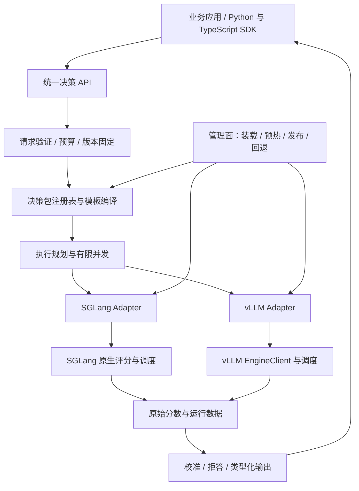

# Jev Runtime 项目实施计划

版本：立项草案 v1.0 · 日期：2026-09-27 · 工作名称：Jev Runtime，包名最终发布前另行检查。

**建议建设一个面向现有模型的决策运行时：使用 SGLang / vLLM 执行模型计算，以插件接入，以可版本化的决策包交付任务能力。** 默认复用底模权重，提供 Choice、Boolean / Noul、Score、Rank；任务需要更高质量时，接入校准、LoRA 或专用决策头。

四个核心承诺：双引擎产品化、决策能力在线装卸、主流开放模型的广泛兼容、可复现的性能收益。它们分别对应明确的发布门槛，而不是一句“支持任何模型自动转换”。

本计划采用以下排期假设：3 名全职工程师；首个正式版以文本为主；有可用于双引擎验证的 NVIDIA GPU；业务侧能提供标注和试点流量。视觉模型、GPU 专用决策头和大型分布式部署列为后续阶段。若这些能力必须同时首发，应增加人力或延长排期，不能把实验状态标成正式支持。

本次完成的是文档和源码核对、方案设计、任务拆分，没有执行 GPU 训练或推理基准。下文的性能数值均为拟定验收目标，不是已取得的结果。

---

## 1. 项目定位与发布范围

### 1.1 用户最终获得什么

部署者可以选择已有 SGLang / vLLM 服务，加载一个决策包，然后使用统一 API 获得带类型的判断。决策包包含任务定义、模板、标签映射、校准配置、版本信息，以及可选的 LoRA / 决策头。

典型应用：意图路由、工具选择、内容分类、规则符合性判断、候选排序、等级评分、证据充分性判断。应用负责定义任务和后续动作，运行时负责评分、约束、版本管理与服务质量。

产品交付包括：

1. `jev-core`：协议、评分语义、模板编译、校准与策略。
2. `jev-sglang`、`jev-vllm`：可独立安装的引擎适配包。
3. `jev-gateway`：可连接已有引擎的独立服务，也提供管理接口。
4. `jev-sdk`：首发 Python SDK；TypeScript SDK 在接口冻结后生成或实现。
5. `jevctl`：模型探测、决策包构建、评测、上线、回退。
6. `jev-eval`：模型认证、准确率与概率质量、性能和故障验证。
7. 版本化决策包格式、兼容矩阵、部署镜像与运行手册。

这些是拟建组件，当前尚不存在可安装的本项目发行包。

### 1.2 什么叫“转成 Jev”

分成三个能力层，不混用名称：

| 能力层 | 实际发生的变化 | 数据要求 | 对外描述 |
|---|---|---|---|
| 决策接口适配 | 复用底模，在确定位置读取标签分数，返回类型化结果 | 无需训练数据；仍需验收数据 | 已有模型获得 Jev 风格决策接口 |
| 任务能力适配 | 固定任务模板、校准、拒答规则；可选 LoRA | 校准或训练样本 | 对指定任务验证过的决策能力 |
| 专用架构适配 | 新读出头、共享上下文头、裁层等 | 训练与独立验证数据 | 对指定模型和任务验证过的结构优化 |

不能用第一层的工程完成度，宣称得到官方 Jev 的训练结果、概率可靠性或同等能力。现有项目也采用不同结构，Jev 风格 API 并不对应一种统一、可无损转换的网络架构。

### 1.3 首个正式版的边界

**必须交付：**

- SGLang 与 vLLM 两个后端都能提供完整文本决策 API。
- 两个引擎适配包、独立接入模式，以及两个引擎各自经过认证的嵌入式接入方式。
- Choice、Boolean、Score、Rank；动态候选；批请求；超时与取消。
- 决策包加载、预热、发布、禁用、回退、排空后卸载。
- 模型能力探测、明确失败原因、固定版本兼容矩阵。
- 原始分数、归一化语义、校准状态、拒答状态可区分。
- 可重复的质量评测与端到端性能报告。
- 监控、限流、请求预算、管理接口隔离、部署和升级手册。

**经过逐项验证后开放：** LoRA 动态加载；量化模型；TP；推理模型关闭思考后的决策模式。它们不能由“底模能生成文本”直接推导为可用。

**后续版本：** VLM、GPU 专用头热切换、共享上下文的动态候选头、大型 MoE / 多机、跨引擎自动流量迁移、更广硬件矩阵。首版不自研推理调度器，不维护完整引擎分叉，不把自动裁层设为默认路径。

## 2. 已核实的上游基础，以及对方案的影响

### 2.1 版本基线

截至核对时，GitHub 最新正式发布为 [SGLang v0.5.20](https://github.com/sgl-project/sglang/releases/tag/v0.5.20) 和 [vLLM v0.30.0](https://github.com/vllm-project/vllm/releases/tag/v0.30.0)。建议第一周先以这两个版本建立验证环境；只有测试通过后，才写入本项目“支持版本”。当前版本号不是兼容性测试结果。

同时检查了 SGLang 主干 `c73f7077eb051ceeaadfa8819b20ed6d4912e8de`。该版本已有 `/v1/decisions` 和 `/v1/systemone` 路由，而本次检查的 v0.5.20 `http_server.py` 中尚无这两个路由。因此，不把主干能力写成当前正式发行版能力。[SGLang 主干路由](https://github.com/sgl-project/sglang/blob/c73f7077eb051ceeaadfa8819b20ed6d4912e8de/python/sglang/srt/entrypoints/http_server.py)、[v0.5.20 路由](https://github.com/sgl-project/sglang/blob/v0.5.20/python/sglang/srt/entrypoints/http_server.py)。

### 2.2 可以直接利用的能力

| 引擎 | 已有能力 | 本项目的实现选择 |
|---|---|---|
| SGLang v0.5.20 | `sglang.srt.plugins` 入口、HookRegistry、标签评分 `/v1/score` | 复用评分和原调度器；薄适配包负责协议、生命周期和可观测性 |
| SGLang 主干 | 类型化决策和 System One 路由、标签合法性检查等 | 作为互操作对象和基线；接口正式发布后再增加原生委托路径 |
| vLLM v0.30.0 | `vllm.endpoint_plugins`、`vllm.general_plugins`、指定 token logprob | HTTP 扩展走 endpoint plugin；普通评分复用 EngineClient |
| 两个引擎 | 有条件的运行时 LoRA 装卸 | 放到统一控制器之后；逐模型、精度、并行配置认证 |

SGLang 插件初始化具有单进程只加载一次的保护；vLLM 也有类似机制。vLLM 的 endpoint plugin 只覆盖 HTTP 层，需要 worker 扩展时必须另做 general plugin。**安装一个包，并不等于能将新 Python / CUDA 代码无重启注入所有运行中的 GPU worker。** [SGLang 插件源码](https://github.com/sgl-project/sglang/blob/v0.5.20/python/sglang/srt/plugins/__init__.py)、[vLLM 插件源码](https://github.com/vllm-project/vllm/blob/v0.30.0/vllm/plugins/__init__.py)、[vLLM Endpoint Plugins](https://github.com/vllm-project/vllm/blob/v0.30.0/docs/design/endpoint_plugins.md)。

### 2.3 两个不能忽略的评分差异

- SGLang v0.5.20 的 CausalLM 评分实现使用 `max_new_tokens=0` 读取标签 logprob。应对认证版本验证 token 位置、返回数组形状和 `completion_tokens`，不能只检查 HTTP 200。[评分实现](https://github.com/sgl-project/sglang/blob/v0.5.20/python/sglang/srt/managers/tokenizer_manager_score_mixin.py)。
- vLLM v0.30.0 的生成式评分内部使用 `max_tokens=1`，返回每个 item 的第一标签分数；它不直接返回我们需要的所有多分类标签分布。完整分布通过插件调用 EngineClient 获取指定 token 的 logprob。不能把整个产品描述成“两端都零生成 token”。该实现也不意味着做了一次额外的自回归 decode 前向，应分别统计采样 token 与实际引擎计算。[生成式评分实现](https://github.com/vllm-project/vllm/blob/v0.30.0/vllm/entrypoints/generate/generative_scoring/serving.py)。

### 2.4 与已有 Jev 项目的关系

| 借鉴对象 | 适合借鉴 | 本项目要补足 |
|---|---|---|
| [LLM2Jev](https://github.com/Yinsongxu/LLM2Jev) | 免训练候选评分、模板处理、共享前缀组织 | 双引擎合同、负载下取消/限流、版本切换和概率语义 |
| [AnyJev](https://github.com/nokia-applied-research/AnyJev) | 任务校准、固定任务头、不同速度/质量配置 | 任务绑定的显式声明、动态问题回退、服务化生命周期 |
| [vllm-jev](https://github.com/mode-io/vllm-jev) | 已训练决策模型的原生推理集成 | 通用底模适配、SGLang 对等支持、统一认证与管理 |
| [simple-jev](https://github.com/featherless-ai/simple-jev) | 简洁评分路径和训练实验 | 高并发服务、运行时插件管理、全面矩阵 |
| 上游原生接口 | 已有评分与调度能力 | 跨引擎一致的产品行为、决策包、校准、发布与验收 |

复用代码前逐文件检查许可证和依赖，并保留归属。项目价值应随着上游增强转向更薄的接入层、更完整的认证与任务交付，不依赖长期重复维护上游已有接口。

## 3. 整体架构



### 3.1 两种部署方式共用一个核心

**独立接入模式（Attach）**：业务 → Jev Gateway → 已有引擎。适合先接入存量服务，安装/升级 gateway 不需要重新加载底模。引擎缺少必要评分能力时，探测失败并给出升级或启用插件说明；不能假设任何 OpenAI 兼容端点都足够。

**嵌入式模式（Embedded）**：业务 → 引擎内 Jev endpoint → 同进程 EngineClient / TokenizerManager。适合减少网络往返、直接取得全部标签分数，及后续 GPU 读出优化。首次加载原生插件通常需要重启对应进程；之后决策包的运行时切换不需要重载底模。

两种方式必须复用相同的协议验证、模板、归一化、校准代码。保持“同一请求、同一决策包、同一模型”的行为一致；网络和调度差异单独测量。

### 3.2 数据面与管理面

- 数据面只接收决策请求、固定包版本并执行。禁止在请求临界路径下载模型、pip 安装、拟合校准器或 JIT 编译新 kernel。
- 管理面处理构建、预热、发布和回退，采用显式租约与 CAS 更新，防止两个发布者相互覆盖。
- 配置与产物存放在版本化存储中；单机开发可用本地目录。正式部署使用对象存储保存不可变产物，用具备条件更新能力的数据库保存激活指针。
- 引擎拥有模型、KV cache 和 GPU 调度。Jev 层不复制一套 KV 管理器。
- 多副本通过“已准备副本集合”执行发布。未准备完成的副本不接新版本流量；请求携带不可变版本号，避免在滚动发布中混用产物。

### 3.3 核心接口草案

```python
class EngineAdapter(Protocol):
    async def probe(self) -> Capabilities: ...
    async def score_labels(self, batch: ScoreBatch) -> ScoreBatchResult: ...
    async def cancel(self, request_ids: list[str]) -> CancelResult: ...
    async def prepare_artifact(self, artifact: ArtifactRef) -> PreparedArtifact: ...
    async def retire_artifact(self, artifact_id: str) -> RetireResult: ...

class ModelAdapter(Protocol):
    def inspect(self, model_info: ModelInfo) -> ModelContract: ...
    def compile(self, task: TaskSpec, contract: ModelContract) -> CompiledTask: ...
    def validate_labels(self, compiled: CompiledTask) -> LabelContract: ...
```

`Capabilities` 至少包括：引擎版本、模型 revision、架构、tokenizer / template 摘要、精度、LoRA、指定标签 logprob、返回 logprob 位置、标签数量限制、取消能力、prefix cache、并行配置，以及这些能力是配置宣称还是探测验证。

`ScoreBatchResult` 至少包括：每个问题/分支的完整标签 logprob、分数所属位置、评分语义、逻辑输入 token、引擎报告 token、缓存指标可用性、完成状态、错误、请求 ID。未知计数返回 `null`，不能填零。

## 4. 决策语义：优先解决概率与质量的可信度

### 4.1 三条执行路线

| 路线 | 计算形式 | 优点 | 代价和适用条件 |
|---|---|---|---|
| joint-label | 一道题列出全部候选，在标签位置读取 K 个分数 | 常见小 K 场景只需一条评分序列 | 候选占上下文；需测试顺序、标签和位置偏差 |
| independent-candidate | 每个候选分别进行 yes/no 评分 | 任意长度候选描述；容易做绝对支持和前缀复用 | K 个分支；二分类分数不是互斥多分类概率 |
| trained-readout | 固定任务头或训练后的动态候选头 | 有机会降低候选计算和提升任务质量 | 依赖训练、模型与任务版本；跨任务不自动成立 |

首版实现前两条；第三条作为扩展接口，首个正式版不依赖它达到功能闭环。

默认可以由模型 profile 推荐 joint-label，但最终策略绑定任务版本。**性能规划器只能在语义相同的执行方式间切换**，例如候选并行度或缓存调度；joint 与 independent 会改变预测分布，必须分别校准和验证，不允许按当前负载无声切换。

### 4.2 Choice

Joint 模式对指定候选标签的原始 logprob `ell_i` 做：

`p_i = exp(ell_i / T) / sum_j exp(ell_j / T)`，计算使用稳定的 logsumexp。

这表示限定答案集合后的相对分布。保留 `label_mass = sum_i exp(ell_i)` 作为“模型下一 token 落在这些标签上的质量”的诊断指标；它不是正确率或证据充分性。只拿到条件分布而没有全词表归一化 logprob 的后端，不能伪造 label_mass。

Independent 模式先计算 `s_i = sigmoid(ell_yes_i - ell_no_i)`。保留每个 `s_i`；若再生成候选分布，必须返回其归一化方法，如 `normalized_support` 或单独拟合的 multiclass calibration。未校准时不要把这些值当作互斥事件的真实概率。

不能遇到缺失分数、NaN 或全部无效值后回填均匀分布并宣称成功。遇到并列最高分，按任务的 tie policy 返回并列、拒答或显式确定性选择；响应必须注明。

### 4.3 Boolean / Noul

返回 yes/no 条件分布、`p_true` 和可选决策阈值。默认阈值只是业务规则；若需要可靠概率，应在代表性标注集上校准。`undetermined` 是决策状态，不强行归并成 false。

### 4.4 Score

候选必须是带描述的等级，如“差/一般/好”。输出完整等级分布和最高概率等级。只有用户提供 `values` 并接受等级间数值距离的含义时，才输出期望值 `sum p_i * value_i`。仅有有序等级时，不默认把 0、1、2 的等距当作业务事实。

### 4.5 Rank

首版使用逐候选评分排序，返回分数、稳定排序与并列信息；不默认计算全量两两比较的 O(K²) 路径。候选集很大时支持外部检索后 rerank，明确召回阶段可能漏掉最佳答案。分组后决赛会改变问题上下文，作为独立模式认证，不能冒充原始全量 softmax。

### 4.6 校准与拒答

- 无标注时返回 `calibration.status = uncalibrated`，不给出虚构的“已校准 confidence”。
- 第一阶段实现 temperature scaling 和二分类的简单参数化校准；更复杂方法在数据量足够且独立集收益明确后加入。
- 校准器绑定模型 revision、精度、模板、任务、评分模式、候选空间定义和数据版本。对语义等价且已验证的后端可以共用，否则分后端校准。
- 数据按任务/来源/时间或用户分组拆分，避免近重复、同会话泄漏。训练、校准、选择阈值和最终评估不得复用同一测试集。
- 动态候选包必须测试未见过的问题和候选，而不仅是同一个固定任务的新输入。
- 拒答可以来自质量模型、可校准支持度、缺失候选、策略限制、超时或数值问题。区分每个原因，不以低熵等同高可靠性。
- 发生拒答时，应用可选择升级到慢模型/人工/补充证据。升级模型调用是显式可配置行为，单独记成本与延迟。

建议每个试点任务先整理 1,000–3,000 条有来源和标注说明的数据；该区间是启动工作量估计，不保证足够。稀有错误、低风险阈值验证需要更大样本和置信区间。

## 5. 热插拔的完整实现合同

### 5.1 支持什么样的热插拔

| 对象 | 首版承诺 | 实现方式 | 对在途请求的影响 |
|---|---|---|---|
| 任务说明、标签、模板 | 在线切换 | 不可变决策包 + 激活指针 | 老请求继续旧版本 |
| 校准参数、拒答阈值、路由配置 | 在线切换 | CPU 产物预加载 + 原子发布 | 老请求持有旧快照 |
| 启用/禁用决策能力 | 在线切换 | 路由状态与引用计数 | 禁用后不接新请求；旧请求排空 |
| LoRA | 对认证组合支持 | 引擎原生装卸 + 本项目排空控制 | 旧版本保留至引用归零 |
| 新 gateway 插件代码 | 服务级无中断替换 | 新子进程/副本预热后切流 | 旧进程排空，不做 importlib.reload |
| 新引擎插件代码 / CUDA kernel | 滚动升级 | 新 worker / engine 副本 | 需要冗余容量；不是同进程热装 |
| 基础模型权重 | 服务级切换 | 双模型副本或双服务切流 | 单卡放不下两份时不承诺无中断 |
| GPU 专用头 | 后续认证能力 | 固定形状槽位、预加载、版本化读出 | 多 rank 一致发布、事件同步和延迟释放 |

LoRA 官方运行时接口有启用条件。生产部署中把这些管理接口放在受控内网，发布前预取经过校验的产物；请求不能携带任意远程仓库要求服务动态下载。[vLLM LoRA](https://github.com/vllm-project/vllm/blob/v0.30.0/docs/features/lora.md)、[SGLang LoRA](https://github.com/sgl-project/sglang/blob/v0.5.20/docs/docs/advanced_features/lora.mdx)。

### 5.2 生命周期

```text
UPLOADED → VALIDATED → PREPARING → READY → ACTIVE → DRAINING → RETIRED
                  ↘ FAILED         ↘ FAILED

已有 READY / ACTIVE 旧版本在新版本失败时继续服务。
回退通过重新激活保留的旧版本完成，不覆盖原产物。
```

上线操作的步骤：

1. 校验 manifest、内容 hash、模型指纹、接口 ABI、资源预算。
2. 在目标副本下载/加载，确认需要的 tokenizer 和模板与模型一致。
3. 运行固定 canary 样本，包括正常、无效输入、并列、取消和边界候选数。
4. 完成模型/LoRA/编译预热；未预热完的版本不得进入 READY。
5. 需要 GPU 产物时等待全部参与 rank 返回相同版本与成功状态。
6. 将 READY 副本加入新版本路由集合，用 CAS 更新激活版本。
7. 新请求在入口固定版本；每个子分支携带同一 `bundle_digest` 和 `generation`。
8. 老版本停止接收新请求；等待引用计数归零和 GPU 使用事件完成。
9. 卸载老版本。超时则保留为 DRAINING 并报警；强制终止是单独管理动作。

多副本无需“全网同一纳秒切换”，但必须满足：响应可追溯版本、一个请求内部版本一致、只有 READY 副本接新版本、回退不依赖重新下载。

### 5.3 并发正确性

- 请求开始时取得 immutable snapshot，不能在每个候选分支执行时重新查询 active。
- 请求取消后，必须给每个引擎子请求发送取消并回收引用；客户端断连不等于引擎任务已取消。
- 装载/卸载串行化到引擎实例级操作队列；不同包的 CPU 校准器可以独立准备。
- 管理操作有幂等键、预期旧版本、超时和状态查询。
- 发布过程中发生任一 rank 失败，不激活半成品；清理已准备资源或保留可重试状态。
- 控制面短暂不可用时，已加载的数据面继续使用当前快照，停止发布新版本。

### 5.4 缓存隔离与复用

需要区分“应用结果缓存”和“引擎 KV cache”：前者由本项目控制，后者由引擎控制。

应用结果缓存 key 包含：模型 revision、精度/量化配置、LoRA revision、tokenizer/processor/template hash、任务和候选规范、评分模式、校准和策略版本、输入内容摘要、租户隔离策略。

KV 复用遵循实际 token、模型权重/LoRA 与引擎的 cache 身份规则。改变校准阈值而不改变模型计算时，不要求清空 KV；改变模板、LoRA、图像预处理或模型权重时，不能继续复用旧的等价性假设。需要核验引擎是否正确区分 adapter，不能只在 gateway 写一个 namespace 就认为隔离完成。

首版不支持 SGLang 与 vLLM 直接交换 KV。关闭插件、回退任务包时不做无差别全局 cache flush。图像扩展阶段使用内容与处理器身份，不能仅用图片 URL 当作稳定身份。

## 6. 如何覆盖大多数现有模型

### 6.1 兼容依据

通用路径依赖三个条件：引擎能正确加载并运行该模型；能在约定位置获得需要的分数；该模型有经过确认的输入模板与标签编码。通用适配优先复用引擎输出，不要求所有模型都具有 `model.layers`、相同 attention 或相同 LM head 内部命名。

因此，Dense / MoE / GQA / MLA / 混合注意力不是通用接口层必须分别重写的理由；它们是需要覆盖的测试维度。对于无法取得约定分数的架构、闭源 API、仅 embedding 的模型、扩散生成模型，返回明确的能力边界，不能强制塞入 CausalLM 路径。

### 6.2 自动探测流水线

```text
读取模型/引擎信息
  → 固定 revision 和 tokenizer/template
  → 判定模态、原生任务、量化、并行方式
  → 编译真实 assistant 答案位置
  → 验证候选标签在该位置是不同单 token
  → 获取指定标签完整 logprob
  → 对照参考实现和边界样本
  → 输出能力报告与适配配置
```

探测结果分为 `supported`、`requires_profile`、`degraded`、`unsupported`，附机器可读原因与证据。禁止探测失败后静默改成生成一段 JSON 来完成请求。

标签检查必须验证 `tokenize(prompt + label)` 确实等于 `tokenize(prompt) + [label_id]`，不能只对标签单独 encode 后取第一个 token。需要处理前导空格、特殊 token、assistant 前缀、思考开关以及重复 label ID。

候选文本本身可以是长句；单 token 限制针对内部答案标签。找不到足够合法标签时，先尝试经过认证的标签表或切换到已批准的独立候选模式；多 token teacher-forced 评分作为显式降级路径另行实现和衡量，不能默认与单 token 同速同义。

### 6.3 初始认证清单草案

第一周冻结至少 20 个具体 checkpoint 及 revision，下表是候选清单。这里不宣称这些组合已经通过本项目测试，也不把同一底层架构的衍生模型算成全新的架构覆盖。

| 模型线 | 候选 checkpoint 数 | 建议覆盖 | 主要验证点 |
|---|---:|---|---|
| Qwen | 4 | Qwen3 0.6B / 8B / 30B-A3B，Qwen2.5 7B Instruct | 小模型、Dense/MoE、思考模板 |
| Llama | 3 | Llama 3.2 1B / 3B，Llama 3.1 8B Instruct | assistant header、标签边界 |
| Gemma | 3 | Gemma 3 1B / 4B / 12B 的文本输入路径 | softcap、模板、不同尺寸；不据此认证图片 |
| Mistral | 2 | Mistral 7B Instruct v0.3，Mistral Small 3.1 24B 的文本路径 | tokenizer / 模板差异 |
| Phi | 2 | Phi-3 mini、Phi-4 mini instruct | 模板、不同 vocab |
| DeepSeek 蒸馏 | 3 | R1 Distill Qwen 1.5B / 7B、Llama 8B | 推理模式限制；不增加独立架构计数 |
| GLM | 1 | GLM-4 9B Chat | 模型专用模板 |
| OLMo | 1 | OLMo 2 7B Instruct | 非 Qwen/Llama 模板路径 |
| SmolLM | 1 | SmolLM2 1.7B Instruct | 低资源开发与回归 |
| 合计 | 20 | 逐一固定实际 model ID、revision 与许可条件 | 两个引擎合计 40 个基础组合 |

若用户生产清单主要是更新的模型线，应在第一周用生产清单替换候选项并冻结；冻结后不得为了漂亮的覆盖率移除失败项。模型卡、上游支持表、实际加载测试共同确定最终清单。

### 6.4 “大多数”的可验收定义

- 固定 20 个业务代表 checkpoint，两个引擎分别至少 18/20 通过功能认证，即各 ≥90%，同时至少覆盖 6 个独立模型架构/模板组。
- 同时报告原始 40 组合分母，以及其中上游本身可运行的组合分母；不把上游不支持静默从统计中删除。
- 若有生产用量清单，另报告覆盖的请求量/模型用量比例，目标 ≥95%；权重来源和时间窗口公开。
- 每个引擎必须独立达标，不能用一个引擎补偿另一个的失败。
- “能返回有效数据”“评分与参考路径一致”“业务质量达到门槛”“性能达标”是四列不同状态。
- 精度、量化、LoRA、TP、VLM 分开认证。某模型 BF16 单卡通过，不代表 INT4 + TP4 + LoRA 也通过。

认证记录至少包含：引擎与插件版本、模型与 tokenizer revision、GPU/驱动、dtype、量化、并行方式、模板 hash、label contract、评分模式、参考误差、任务质量、性能报告、已知限制、认证时间。

## 7. 高性能路线与成本模型

### 7.1 首先消除多余工作

按优先级实施：

1. 直接读取需要的标签分数，避免为了结果格式生成自然语言和 JSON。
2. 对同一问题的多个标签一次取回完整分布，不为每个标签重复完整请求。
3. 模板预编译、tokenizer 与模板缓存、连接复用、异步 I/O。
4. 批请求展开后进行有限并发，复用引擎 continuous batching。
5. 让公共上下文位于真正相同的 token 前缀中，并验证与原任务语义一致。
6. 在 profiling 支持时优化 label gather、读出和 CPU/GPU 传输。

“接口只返回 K 个标签”不表示引擎只算了 K 个词表投影。是否计算完整 LM head、是否拷贝完整 logprob、是否引入 CPU 同步，都要用源码和 profiler 证明。

### 7.2 两种基本成本

令公共上下文长度为 `L`，候选数为 `K`，第 i 个候选后缀长度为 `s_i`。

- 独立候选冷路径：重复处理公共上下文，逻辑前缀处理量约为 `K*L`。
- 理想共享前缀路径：公共部分约处理一次，再处理各后缀；但后缀仍需 attention 公共 KV，且存在 cache 查找、分支调度与内存开销。
- 联合候选路径：一条长度约为 `L + sum(s_i) + task_tokens` 的序列，候选之间发生上下文交互。

上述只是工作量结构，不是延迟线性公式。注意力类型、MoE、kernel、显存带宽、批大小、TP 通信、缓存状态和队列都会改变实际时间。

### 7.3 共享前缀不能靠模板想象

- 默认先利用引擎原生 cache 和正常并发请求，测出实际 token 命中与重复 prefill。
- 当多个冷分支同时入队时，共同前缀未必已完成缓存，不能假设天然只算一次。
- 可比较“全部并发”“先完成一个实际候选再提交其余候选”等等价执行策略；额外预热请求也必须计入成本。
- 对长 L、大 K 的候选组做有限批次，避免一个大请求占满引擎队列。
- 只在同一评分模式内自适应选择调度方案，并在灰度前验证 tail latency。
- 不为了缓存把原生模型协议硬改成不熟悉的文本格式；模板变化必须重新验证质量与校准。

### 7.4 请求预算与公平性

预算至少考虑：问题数、候选数、展开分支数、总编译 token、预计 uncached token、deadline、租户配额。单纯限制 HTTP QPS 不足以限制 GPU 工作量。

建议首版默认：每请求最多 16 道题、每题最多 64 个候选、每请求最多 128 个实际评分分支；精确上限由模型和能力探测收紧。超限在提交引擎前返回明确信息。

每租户有最大展开并发，每引擎有全局 inflight token/branch 预算，短任务与大任务分队列或采用加权公平出队。保留超时预算给结果组装，不在 deadline 到期后继续排入 GPU。

不重写引擎内部调度。Jev 层负责 admission 和子请求编排；如果共享引擎上的聊天请求 P99 被长 prefill 明显影响，应提供独立决策池部署模式。

### 7.5 原生 GPU 优化：后续受控路线

对普通 LM head，限定标签的条件分布可以只计算所需输出行；但要处理 tied weights、bias、logit softcap、量化布局、TP 词表分片和正确的规约。只有这些语义成立且实现经过认证，才能启用。

如果同时要求完整词表的 label_mass，就需要完整分母或另外的准确实现；不能一边跳过全词表计算，一边无代价保留全词表概率声明。

原生 head 路线只将最后需要的隐藏状态参与 GPU 读出，返回 `[batch, K]` 结果。避免为每个任务把 `[batch, seq, hidden]` 搬回 CPU。按 head 类型和 shape 分组，避免每个请求单独 kernel 调度和 graph recapture。

GPU 头的热切换采用固定 shape 槽位和 epoch 引用，先加载预热，再切换；不同 shape 需要新的预热/graph 路径。TP/DP 各 rank 一致验证，不能逐 rank 原地覆盖正在使用的权重。

进入该阶段的条件：profiling 表明读出/词表投影占比值得优化，且通用路径已经质量、稳定性达标。若瓶颈主要是长上下文 backbone prefill，应优先处理上下文与候选执行，不能为了“有 kernel”而优化无关环节。

## 8. API、产物格式与插件边界

### 8.1 路由规划

独立 gateway 的公共协议使用 `/v1/decisions`；嵌入引擎的路由放在 `/plugins/jev-runtime/v1/decisions`，防止与 SGLang 已有或未来原生接口冲突。gateway 可选择转发到原生实现，但返回合同由本项目版本控制。

兼容 TypeSafe 风格的 `/v1/systemone` 作为独立转换层，逐项列出支持的字段与语义差异。相同路径/字段名不自动构成全部官方行为兼容。

### 8.2 请求示例——拟建接口

```json
{
  "model": "support-router",
  "bundle": "support-intent@3",
  "input": {"text": "我被重复扣款，希望退款"},
  "questions": [
    {
      "id": "intent",
      "type": "choice",
      "instruction": "选择用户当前最主要的诉求",
      "options": [
        {"id": "billing", "description": "支付、账单或退款问题"},
        {"id": "technical", "description": "产品功能或故障问题"},
        {"id": "other", "description": "其余诉求"}
      ]
    }
  ],
  "execution": {
    "timeout_ms": 1000,
    "allow_partial": false
  }
}
```

业务 ID 保留在接口中；编译到模型 prompt 的中性标签由模板决定，候选的真实语义来自说明。校准、评分模式和权限来自决策包，普通客户端不能任意覆盖已认证配置。

### 8.3 响应示例——数值仅为格式示意

```json
{
  "request_id": "dec-example",
  "status": "completed",
  "bundle": "support-intent@3",
  "bundle_digest": "sha256:example",
  "engine": {"name": "vllm", "version": "0.30.0"},
  "answers": {
    "intent": {
      "status": "answered",
      "type": "choice",
      "value": "billing",
      "probabilities": {"billing": 0.82, "technical": 0.11, "other": 0.07},
      "probability_semantics": "conditional_label_distribution",
      "calibration": {"status": "uncalibrated", "id": null},
      "abstained": false,
      "reason": null
    }
  },
  "usage": {
    "questions": 1,
    "scoring_sequences": 1,
    "engine_completion_tokens": 1,
    "uncached_prompt_tokens": null
  }
}
```

`status=completed` 只表示执行完成；不能从这个状态推导内容正确。原始 logprob、label_mass、trace 和 prompt hash 可由诊断权限按需返回。

错误必须细分：无效标签、模型能力不支持、版本不匹配、校准器不兼容、预算超限、deadline、引擎不可用、部分分支失败、数值异常。默认任一必要分支失败就不输出完整成功分布；允许 partial 时返回每题状态，缺失题不能以空值伪装成功。

### 8.4 决策包 manifest 草案

```yaml
schema_version: 1
id: support-intent
version: 3
engine_contract: label-logprobs-v1
model:
  id: Qwen/Qwen3-8B
  revision: REQUIRED_IMMUTABLE_REVISION
  tokenizer_sha256: REQUIRED_HASH
  template_sha256: REQUIRED_HASH
  dtype: bfloat16
task:
  mode: joint-label
  questions: tasks.json
  label_contract: labels.json
  candidate_policy: fixed
calibration:
  artifact: null
  status: uncalibrated
policy:
  tie: abstain
  invalid_scores: error
  max_scoring_sequences: 128
artifacts:
  lora: null
  readout: null
validation:
  report: evaluation.json
  dataset_sha256: REQUIRED_HASH
compatibility:
  engine_profiles: [sglang-certified-profile, vllm-certified-profile]
```

发布工具拒绝含 `REQUIRED_*` 占位符的 manifest。动态候选包另外记录候选数范围、任务域、长度分布和未见候选验证；不能套用固定候选校准器后只改一个字段。

### 8.5 插件包入口草案

```toml
# jev-vllm 的元数据示意
[project.entry-points."vllm.endpoint_plugins"]
jev_runtime_api = "jev_vllm.endpoint:JevEndpointPlugin"

# 后续需要 worker 读出扩展时才注册；普通标签评分不必先做它。
[project.entry-points."vllm.general_plugins"]
jev_runtime_worker = "jev_vllm.worker:register"

# jev-sglang 的元数据示意
[project.entry-points."sglang.srt.plugins"]
jev_runtime = "jev_sglang.plugin:register"
```

vLLM endpoint 通过 `attach_router` 和 `init_state` 接入；required_tasks 限定为可评分的生成任务。显式配置 `VLLM_PLUGINS` allowlist，不能以“安装成功”判断路由已启用。

SGLang 适配集中在一处启动接入层：使用认证版本的插件/启动扩展完成路由注册及 TokenizerManager 绑定。对生命周期对象的接入点必须在第二周完成真实进程验证；不在 scheduler、attention 或采样循环散落 patch。若正式版生命周期不适合安全挂路由，使用该包自带 launcher 在启动阶段注册，已有服务则走 attach 模式。相关内部接入点随引擎版本做合同测试。

两端的 registration 必须幂等，不能在每个 worker 重复启动 HTTP 服务或重复注册 GPU 权重。插件关闭时保持原引擎推理路径可用；测量无请求经过插件时的性能影响。

### 8.6 建议的仓库结构

```text
jev-runtime/
  packages/
    core/                 # schema、编译、评分语义、校准与策略
    gateway/              # 独立服务、控制面与版本注册表
    sglang/               # SGLang 版本适配与插件
    vllm/                 # vLLM 版本适配与插件
    sdk-python/
    sdk-typescript/
    cli/
  profiles/
    models/               # 模型与模板合同
    engines/              # 引擎版本和能力合同
  bundles/examples/       # 示例任务包，不放大模型权重
  eval/
    reference/            # 模型参考 scorer
    quality/              # 任务、校准、鲁棒性
    performance/          # 请求回放和原始运行 manifest
    lifecycle/            # 热切换、取消和故障注入
  tests/contract/         # 两后端和两种部署方式共用合同
  deployment/             # 分引擎镜像、compose、最小集群示例
  docs/                   # 协议、接入、运维、证据与限制
```

ModelAdapter 只定义模型需要的模板/标签差异；EngineAdapter 只处理引擎接口差异。任务特有的判断和阈值属于 bundle。避免把某个模型的模板写进 HTTP handler，或把业务规则写进 GPU runner。

### 8.7 目标用户工作流

下面是希望最终交付的命令体验，**是待实现的 CLI 设计，不是现在可以执行的工具**：

```text
jevctl inspect --engine sglang --url http://engine:30000
jevctl bundle build ./support-intent --profile ./model-profile.json
jevctl evaluate ./support-intent.bundle --dataset ./heldout.jsonl
jevctl bundle prepare ./support-intent.bundle --target staging
jevctl bundle activate support-intent@3 --target staging
jevctl benchmark --suite core --target staging
jevctl bundle activate support-intent@3 --target production --canary 5
jevctl bundle rollback support-intent --to 2 --target production
jevctl bundle retire support-intent@3 --wait-drained
```

`inspect` 生成证据和具体限制；`build` 生成不可变产物；`evaluate` 绑定数据与结果；`prepare` 完成资源加载；`activate` 只操作已准备版本。控制面权限由部署者配置，业务请求本身不拥有发布权限。

## 9. 正确性与质量验证

### 9.1 三层参考

1. 数学层：固定 logits 验证归一化、数值稳定性、排序、期望值、tie、缺失分数处理。
2. 模型层：相同模型 revision、真实 token IDs、dtype 和最后位置，对照 Transformers 或模型官方可运行参考。量化路径先对照同量化可用参考，再单独衡量相对 BF16 的变化。
3. 服务层：相同决策包和请求，经不同部署模式/引擎，核对分支覆盖、取消、超时、版本、结果与 usage。

数值误差不采用一个覆盖所有 dtype 的硬编码阈值。第一周在确定性样本上取得参考差异，按 dtype / quant / TP 冻结误差预算；近似并列样本单列。对远离并列的确定性样本，要求两路径决策一致；其余报告 logprob / probability 误差分布和 argmax 变化，不用平均准确率掩盖逐样本差异。

### 9.2 质量测试集

至少覆盖：正常任务、中文/英文、长候选、候选顺序交换、业务 ID 重命名、同义改写、无关背景、正确候选缺失、多个候选同时合理、反例、信息不足、恶意输入文本尝试改变任务、跨字段约束。

业务质量报告包括：accuracy / macro-F1 或任务适用指标、NLL、Brier、ECE 的分箱方法和样本数、拒答后风险与覆盖率、不同候选数与语言的分组结果。只有可靠 ground truth 才用于这些质量指标；教师一致率单列。

质量发布门槛由试点业务定义。建议至少两个真实任务、四个代表模型；所选高速模式相对批准的基线，其主要质量指标下降不超过 1 个百分点，并给出配对置信区间。样本量不足以判断时不能宣称非劣；可以先发布有明确范围的试点版本。

校准目标优先看 held-out NLL / Brier 和风险覆盖曲线，而不是只追求一个低 ECE。模型或模板更新触发重新验证，不能沿用旧报告。

### 9.3 请求层不变量

- 一道 Choice 返回的键与输入候选一一对应，无缺失、重复和额外候选。
- 同一问题的分数来自相同输入、模板、模型、LoRA、任务包和校准版本。
- 正常概率为有限数，范围合法；要求归一化的模式和为 1。
- Score 的数值映射保存在响应/版本产物中。
- 请求级成功要求所有必需问题/分支成功；HTTP 200 不代替结果检查。
- 部分失败、取消和超时均释放对应引用，不能导致版本永远无法卸载。
- 重试保留幂等语义，不能无上限复制相同评分分支。

## 10. 性能验收与实验设计

### 10.1 必须有的四条基线

| 基线 | 用途 | 比较条件 |
|---|---|---|
| 原生标签评分 | 衡量插件额外开销 | 同模型、模板、标签、dtype、缓存、并发、网络边界 |
| 结构化生成 | 衡量省去生成格式后的整体收益 | 同任务与质量目标，记录输出长度；不能伪装纯 kernel 加速 |
| 候选独立、未做共享优化 | 衡量候选调度和前缀优化 | 同评分语义和完整计算成本 |
| 已有 Jev 实现 | 解释生态位置 | 同模型可比则比较；模型或协议不同则分表报告 |

同时与 SGLang 原生 decisions 的可用版本比较。如果本项目只增加统一管理、并不更快，应如实呈现；产品价值不要求在每种负载下战胜上游原生路径。

### 10.2 核心性能矩阵

基础套件：2 引擎 × 2 代表模型 × 3 上下文长度 × 3 候选数 × 2 并发 × 2 缓存状态 = **144 个场景**。

- 模型：一个常用小/中 Dense 模型；另一个不同架构或小型 MoE，资源不足时明确延期 MoE，不能用未运行结果补齐。
- 上下文：256、2,048、8,192 tokens；使用实际 tokenizer 生成并记录精确长度。
- K：2、8、32。
- 并发：1、16；另做开放到达率的负载扫描寻找饱和点。
- 缓存：跨请求冷、跨请求热；候选内部共享策略额外记录，不能把两个概念混为一个 cache hit。

每场景建议预热后至少 3 分钟稳定测量，重复 3 次；144 × 3 × 3 分钟 = 21.6 个单副本运行小时，不含装载、预热、重试、TP 的多卡占用和长稳测试。大样本 P99 需要追加足够请求，短场景不靠几十条请求声称稳定 P99。

扩展套件：32k context、K=64/128 的能力边界、不同到达率、混合长短请求、混合多题数、TP2、量化、LoRA、取消洪峰、cache 争用，以及与聊天流量共存。

### 10.3 指标和分母

- 请求吞吐：成功完成全部必要问题的 requests/s。
- 决策吞吐：成功问题数/s。
- 分支吞吐：仅用于解释引擎工作量，不当作业务吞吐。
- 时延：端到端 P50/P95/P99；分别记录排队、编译/tokenization、引擎计算/等待、组装阶段。
- 成本：GPU 秒/千次成功决策、峰值/稳态显存、CPU、数据传输。
- 输入量：原始输入 token、展开后逻辑 token、引擎报告 token、可观测的 uncached token；不能由 logical token 推算实际 GPU FLOPs。
- 缓存：明确请求命中还是 token 命中，统计范围是本轮 cohort 还是服务累计值。
- 错误：HTTP、结果结构、缺失分支、deadline、取消、OOM、引擎错误分别统计。
- 质量与性能联表：高速配置对应相同验证集的质量、概率误差和拒答覆盖率。

### 10.4 建议的首版目标

以下目标在第一周用目标硬件和负载校正，并在 Beta 前冻结：

| 项目 | 拟定发布门槛 | 测量边界 |
|---|---|---|
| 插件吞吐开销 | ≥同等原生评分吞吐的 90% | 同语义、固定负载、同网络边界 |
| 本地 gateway 开销 | 无负载排队时，增加的 P95 ≤5ms | CPU 不饱和、小结果；长输入 tokenization 单列 |
| 插件停用影响 | 原引擎吞吐/P95 变化在 3% 预算内 | 预热后重复测量，排除测量噪声 |
| 共享前缀优化 | 长上下文、大 K 的预先指定场景，目标吞吐 ≥1.5× | 是优化目标；未达到则发布真实结果，不能造为通用卖点 |
| 动态配置切换 | READY→新请求使用新版本的 P95 ≤1s | 不包含下载/模型装载；约定副本规模 |
| 持续稳定性 | 24 小时规定负载无无法解释的进程退出、请求泄漏、持续显存增长 | 不是生产可用性 SLA 证明 |
| 热切换可靠性 | 1,000 次配置发布/回退无版本混用、无引用泄漏 | 另做较少次 LoRA/GPU 产物装卸 |

正式支持“高性能”的最低门槛是原生评分开销和容量预算达标；额外加速只对测得的模型/负载发布。不要承诺所有模型/所有输入延迟 <10ms，也不要用远端 API 与本地 GPU 的差距充当架构收益。

## 11. 产品化与运维

### 11.1 可观测性

Prometheus：请求/决策/分支数、错误分类、队列时间、端到端直方图、tokenization 时间、活跃版本、加载/排空状态、inflight、预算拒绝数、可用 cache 指标。

Tracing：一个入口请求关联所有评分子请求、版本快照与管理事件。模型和版本可作为受控低基数维度；用户 ID、完整候选、prompt、任意任务 ID 不直接做 metrics label，防止指标爆炸。敏感文本默认不入普通日志。

### 11.2 故障处理

- 引擎过载：先限流/排队，超过 deadline 直接失败；不盲目重试扩大过载。
- 单分支错误：按合同失败或返回 partial；错误路径不得返回看似可信的完整概率。
- 引擎掉线：熔断并路由到兼容副本；没有等价副本就返回明确失败。
- 新包准备失败：旧包继续服务。
- 包的质量灰度变差：指针回退，记录影响请求的版本范围。
- 引擎跨后端回退：必须使用已认证的任务包/backend profile，不能保证比特级一致。

### 11.3 发布形态

- `jev-core` 不强依赖两套 CUDA / Torch 栈。
- SGLang 与 vLLM 使用分别锁定的 Python 环境和容器，避免把两端硬塞进一个运行环境。
- gateway 镜像尽量不带 GPU 运行库；engine adapter 放进各自引擎镜像。
- 单机提供 compose 示例，集群提供最小 Helm / Deployment 示例、readiness、graceful shutdown 和滚动升级说明。
- 产物默认使用 JSON / safetensors 等可验证格式，安装的代码插件来自受信发行源；外部客户端不能上传任意 Python 执行。
- readiness 不只检查端口，必须确认目标模型可评分、active 包 READY 且最小 canary 成功。

### 11.4 引擎升级策略

首发锁定一组经过认证的版本；随后维护“当前正式支持版 + 上一个正式支持版”，而不是承诺兼容所有历史 release。对上游 main 做非阻断的提前发现测试。

引擎升级依次通过：插件加载 → 模板/标签合同 → 基础模型矩阵 → 多进程取消/LoRA → 性能 → 试点灰度。只有全部必需项完成，才更新支持矩阵。上游新增原生接口优先转为委托调用，减少内部 hook。

## 12. 十二周实施计划

### 12.1 团队配置

| 角色 | 核心职责 | 需要的能力 |
|---|---|---|
| A：引擎与运行时 | SGLang、插件生命周期、并发、取消、LoRA、集成 | 推理服务、多进程、GPU 运行时 |
| B：引擎与性能 | vLLM、评分参考、性能、校准工具与稳定性 | vLLM、profiling、数值与评测 |
| C：产品与质量 | Core/API/SDK、模型 profile、注册表、认证、发布 | Python 服务、模型模板、数据与质量 |

另外需要业务负责人提供任务/验收标准，标注支持核验数据，以及共享的 SRE/基础设施协作。若 C 不具备校准评测能力，需要增加兼职 ML 支持，不能用“自动模型打标”完全替代。

### 12.2 分阶段交付

| 周期 | 里程碑 | 交付 | 退出条件 |
|---|---|---|---|
| W1–W2 | 可行性门槛 | 锁定版本、20 模型清单、两端最小评分、接口草案 | 两引擎各跑通至少 2 模型；证实标签位置、分数和 token 计数；验证插件启动接入 |
| W3–W4 | Alpha | 两端 Choice/Boolean/Score/Rank、统一 API、参考 scorer、安装包 | 相同 fixtures 经两端产生可解释的一致结果；基础错误/取消；可安装与运行 |
| W5–W6 | 运行时版本 | 注册表、任务包热切换、校准/拒答、预算与观测初版 | 配置在线发布/回退；在途请求版本固定；失败不影响旧版本 |
| W7–W8 | Beta | 认证流水线、性能套件、批处理和缓存优化 | 两端认证矩阵公开；主要性能瓶颈定位；试点任务质量报告 |
| W9–W10 | Release Candidate | 认证 LoRA 路线、矩阵补齐、部署/监控、混合负载 | 各端 ≥18/20 基础组合；主要开销门槛通过；可执行回退 |
| W11–W12 | v0.1 正式版 | 稳定性、故障注入、两业务试点、文档/版本包 | 24h 长稳、1,000 次配置切换、发布清单全过；已有真实用户验证 |

W1–W2 是必须做实的门槛：若标签合同或插件接入无法满足要求，立即调整该版本/接入策略；不能先堆产品外壳再发现核心路径不可用。

### 12.3 关键任务与人日

人日为初始工程估算，含相应模块测试，不含业务标注工作；详见配套 JSON 中的依赖和验收。

| ID | 任务 | 负责人 | 人日 | 计划窗口 |
|---|---|---|---:|---|
| P01 | 范围、模型清单与版本合同 | C | 3 | W1 |
| P02 | 引擎能力探测与启动验证 | A | 5 | W1–W2 |
| P03 | 模板编译和标签合同 | C | 5 | W1–W2 |
| P04 | Core 协议与结果语义 | C | 5 | W2–W3 |
| P05 | SGLang 评分适配 | A | 8 | W2–W3 |
| P06 | vLLM 评分适配 | B | 8 | W1–W3 |
| P07 | 参考 scorer 与数值对照 | C | 4 | W3–W4 |
| P08 | SGLang 插件/launcher 与接入 | A | 6 | W4–W5 |
| P09 | vLLM endpoint plugin 与接入 | B | 5 | W4 |
| P10 | 注册表、热切换与回退 | C | 8 | W4–W6 |
| P11 | 校准、拒答与任务评测工具 | B | 7 | W5–W6 |
| P12 | 模型矩阵与认证自动化 | C | 8 | W7–W9 |
| P13 | 预算、批处理与候选编排 | A | 6 | W6–W7 |
| P14 | 取消、超时与异常回收 | A | 4 | W7–W8 |
| P15 | 性能基准与证据产物 | B | 5 | W7 |
| P16 | profiling 与缓存/读出优化 | B | 8 | W8–W9 |
| P17 | LoRA 生命周期认证 | A | 5 | W9 |
| P18 | SDK、部署示例与 CLI | C | 5 | W10 |
| P19 | 监控、管理接口与运行手册 | C | 4 | W10–W11 |
| P20 | 双引擎集成和混合流量验证 | A | 8 | W10–W11 |
| P21 | 长稳、故障注入与热切换压力 | B | 6 | W10–W11 |
| P22 | 发布矩阵、业务试点与验收 | C | 5 | W11–W12 |
| P23 | 性能/质量报告和示例 | B | 3 | W12 |
| P24 | 发布、回退演练与移交 | A | 3 | W12 |

合计 **134 人日**：A 45、B 42、C 47。3 人 × 12 周 × 5 日 = 180 人日，保留 **46 人日**处理集成、不确定性、上游变更和延期，约占总容量 25.6%。这是容量估计，不能把未用缓冲当作可再塞满新功能的空间。

时间窗口允许原型工作提前进行，表中依赖是“完成/发布门槛”，不要求所有工作严格串行。人员按每周容量复核：C 是早期接口与后期认证的主要瓶颈，应优先减少定制 UI 等非核心任务。

### 12.4 人力变化如何影响时间

- 1 人：建议分成通用服务 Alpha、双引擎产品化、认证/稳定性三批，约 6–9 个月；同时自研 GPU 头会显著拉长。
- 2 人：约 4–6 个月，减小同时认证的配置维度，但保留双引擎要求。
- 3 人：12 周是条件满足时的正式版目标，建议对外排期留到 14–16 周。
- 5 人：可并行增加模型认证、VLM 或 GPU 头，但核心评分合同和真实数据准备仍是关键路径。

这些是工程估算，不是资源承诺。硬件、模型访问权限、业务数据、上游 API 稳定性都会影响交付。

## 13. 算力与数据预算

### 13.1 开发环境

- CPU 环境运行协议、数学、模板和管理面测试。
- 一张 24–48GB GPU 可做小模型的两端轮流开发，不能同时证明大模型、双副本热切换和 TP。
- 推荐至少 2 张 80GB 级 GPU 的可用资源，方便两引擎隔离验证和有限 TP；具体可运行模型取决于权重、KV、上下文和预留显存，应按实际加载量验证。
- 测试服务使用独立端口、进程、环境和模型缓存目录规则，避免污染已有生产服务。

容量近似：`模型权重 + KV/运行态 + activation/workspace + adapter/head + graph/通信 + 余量`。双副本无中断升级需要额外模型/服务容量；仅增加少量 CPU 内存无法实现大底模无中断切换。

### 13.2 GPU 时间预估

首版预算建议先预留 **300–600 GPU 小时**：基础兼容矩阵、性能套件、长稳、失败重跑和迭代。其中 TP2 跑一小时计两 GPU 小时。此区间是工作规划估计，第一轮实验后用实际分钟数更新。

不包含大型模型专项、多机通信排障、大规模 LoRA 训练、动态 head 训练。费用使用 `GPU 小时 × 实际采购单价 + 存储/标注/网络成本` 估算；本计划不假设任何供应商当前价格。

### 13.3 数据产物

必须保存数据来源与许可、匿名化规则、task schema、标签说明、split、内容 hash、去重规则、版本。业务数据不随公开性能报告自动发布；公开报告可使用可再分发的任务样本和聚合统计。

训练一个固定任务头或 LoRA 的数据量由 learning curve 决定：从小样本可行性开始，持续看 held-out 指标和失败类别。不要把某个现有项目的几百条样本结果推成普适数据预算。

## 14. 后续版本与技术门槛

### v0.2：预计再增加 4–8 周，按实际资源择优

1. VLM：先选 2 个明确可用的模型/processor 组合，两端覆盖；处理图像身份、预处理一致性、图像 token、encoder cache、批处理和质量评测。
2. GPU 读出：先认证 1–2 个模型族、固定 head shape、单卡，然后扩大 TP；仅在 profile 显示收益时启用。
3. 固定任务 head：借鉴小样本拟合路线，但任务、候选空间、模型指纹和训练数据全部写入包。
4. 真正的动态候选 head：建立训练数据和跨任务测试，再决定是否值得与通用评分并存。

这四项不是一个 3 人团队可无条件同时在 4 周内完成的承诺。建议优先 VLM 或 GPU 读出其中一条；两条并行需要额外人力。

### v0.3：以试点需要驱动

大型 MoE / 多机、异构硬件、跨引擎容量调度、分层 KV、在线质量漂移告警、模型/任务选择器。只有双引擎语义一致和基本生命周期稳定后，再扩展这些维度。

训练或蒸馏新模型属于独立子项目，应有数据、训练成本、质量对照与服务验收。不能以一个插件开发计划覆盖“训练通用 Jev 模型”的全部工作。

## 15. 风险、缓解措施与停止条件

| 风险 | 早期信号 | 处理 |
|---|---|---|
| 引擎接口快速变更 | 内部 import / lifecycle 改动、返回字段变化 | 固定认证版本、薄适配层、上游 main 合同测试 |
| 底模指令/判断质量不足 | 标签分布看似确定但任务准确率差 | 标记模型任务不合格；更换模型或训练，不能靠归一化修复 |
| 大多数模型“可加载但不可决策” | 思考前缀、标签质量低、模板不匹配 | 能力与业务认证分离，提供具体 profile 和限制 |
| 共享前缀收益不稳定 | 热基准好、冷并发差、cache 争用大 | 多种缓存负载、实际命中监控；保留简单调度 |
| 热切换引发混用/泄漏 | 旧包引用不归零、某 rank 不一致 | epoch/refcount、排空、幂等操作和失败回退 |
| 大请求拖垮其他流量 | 分支数突增、队列/P99 升高 | token/branch 预算、有限并发、公平调度、独立服务池 |
| GPU 优化适配过多模型 | softcap/quant/TP 不同导致分叉 | 通用路径始终保留；加速路径按 capability 逐项认证 |
| 单头跨任务失效 | 固定任务好、动态候选显著降级 | head 绑定任务，动态任务回到已认证通用路径 |
| 项目与上游功能重叠 | 原生 decisions 能覆盖基础 API | 上游优先，产品聚焦跨引擎、生命周期、质量与认证 |
| 排期受数据拖累 | 无任务 owner、无标签、质量标准不断变 | W2 前完成首批标注和验收定义；否则只能交技术 Beta |

停止/降级条件：没有可用业务标注时不发布“概率可信”；无法做到全部 rank 一致切换时不开放 GPU 产物在线更新；无法观测实际缓存工作时不宣传 token 计算节省；功能认证分母没有冻结时不宣称覆盖“大多数”。

## 16. 发布验收清单

### 必须通过

- [ ] 两个引擎的安装、启动、最小请求、停止与回退均有真实记录。
- [ ] 当前认证版本可独立复现；无未声明的本地引擎 patch。
- [ ] 四种任务类型、错误和 partial 行为符合公开 schema。
- [ ] 两个引擎各 ≥18/20 基础模型组合，并列出失败项和原因。
- [ ] 校准器与模型/模板/候选定义绑定，未校准状态清晰。
- [ ] 加载、预热、发布、回退和排空有状态机及压力测试。
- [ ] 取消、超时和断连回收全部子请求/版本引用。
- [ ] 原生评分开销、无请求时插件影响达到目标。
- [ ] 冷/热、并发、质量、成本和错误分母的报告完整。
- [ ] 24 小时长稳与故障注入完成；问题闭环。
- [ ] 至少两个真实任务试点；业务 owner 接受质量与拒答行为。
- [ ] 升级、回滚、监控、兼容版本、已知限制可由其他人按文档复现。

### 不能作为替代证据

单元测试全绿、端口监听、HTTP 200、一次小模型 smoke、只有平均延迟、只有本地 Transformers 脚本、只测暖缓存、只有教师一致率，都不能单独证明正式版达到上述要求。

## 17. 第一周的具体执行顺序

**第 1 天：** 建立仓库和包边界，冻结 API 草案与模型清单；创建独立 SGLang/vLLM 环境；记录版本、GPU、驱动、CUDA、模型 revision。

**第 2 天：** 两端各运行同一小模型，取得同一真实 prompt 的标签 logprob；验证 SGLang 零输出配置与 vLLM 一 token 评分的 usage 差异；保存原始请求/响应。

**第 3 天：** 增加第二种架构/模板；完成单 token 标签检查、完整候选返回、失败检查；试验两端插件入口及路由生命周期。

**第 4 天：** 建立最小参考 scorer 和端到端 harness；测直连与 gateway 的开销，确定优先修复的是模板、分数接口还是调度。

**第 5 天：** 输出技术门槛报告、已验证版本、第一批失败案例、主要风险与修订后的工作量。冻结前两周下一步，不把后续 kernel 研发提前成核心依赖。

第一周最重要的产物是：**同一决策合同在两端的真实可用证据，以及能持续接入更多模型的探测和验证机制。**

## 18. 调研方法与证据范围

本计划属于技术可行性审计与工程设计，继承前两轮 Jev 项目比较，并补充检查双引擎当前官方文档、正式 tag 源码、主干源码、发布元数据。方法为 web 搜索、GitHub 公共仓库读取、官方 raw 文件读取及只读代码搜索。

重点核对的来源组：SGLang 评分/插件/HTTP 路由/LoRA；vLLM 插件/endpoint/生成式评分/指定 token 参数/LoRA；LLM2Jev、AnyJev、vllm-jev、simple-jev。上文引用均指向一手资料。源码存在只能证明设计基础，不能证明本项目已经完成集成。

用于定位本计划关键新增事实的检索包括：

1. `site.docs.vllm.ai endpoint_plugins vllm generative_scoring plugin`
2. `site:docs.sglang.io score token_ids_logprob normalize first_token_only`
3. `site:github.com mode-io vllm-jev plugin`
4. `repo:sgl-project/sglang "decisions" "systemone"`
5. `"sglang" "/v1/decisions"`
6. `"sglang" "Scoring API"`

对搜索索引过旧、页面导航干扰和缺失路径，改查官方仓库具体文件；不能用旧 issue 声称当前引擎没有插件系统。本轮保存了 28 份专项源码/文档快照，并核对 2 个最新发布元数据；重点阅读路径和精确内容 hash 见配套证据索引，另有前两轮项目调查作为背景。GitHub release、正式 tag 与 main 明确区分。部分 latest 文档页面因导航过长或路径错误未能有效读取，采用官方 raw 源文件替代。

配套文件：

- [24 项任务与依赖 JSON](backlog.json)
- [源码和发布证据索引](research-evidence-index.json)

事实置信度：所列 API/插件入口及版本差异为源码直接证据，较高；跨引擎合同、状态机和性能路线为设计判断；12 周、134 人日、算力与性能目标是规划估计，需要 W1–W2 实测更新。当前没有本项目 GPU 运行、真实热切换、业务质量或生产负载证据。
